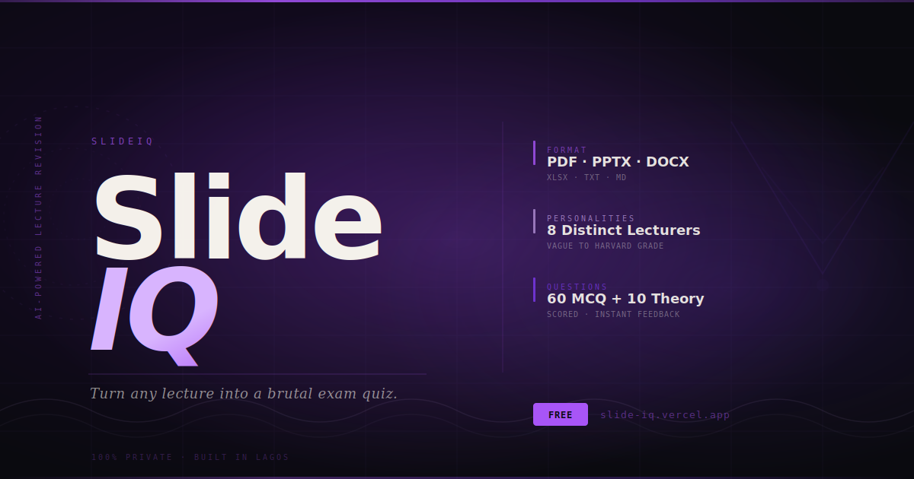

<div align="center">



<br/>
<br/>

**Turn any lecture into a brutal exam quiz — in seconds.**

[](https://slide-iq.vercel.app)
[](https://react.dev)
[](https://firebase.google.com)
[](https://anthropic.com)

</div>

---

## What it does

SlideIQ reads your lecture slides and turns them into a full quiz — MCQ, theory questions, and instant personality-voiced feedback — all in your browser. Nothing leaves your device except the quiz prompt.

Upload a PDF, PPTX, DOCX, XLSX, TXT, or Markdown file. Pick one of 8 lecturers. Get up to 60 MCQ questions and 10 theory questions generated by Claude Sonnet in seconds. Your score, answers, and model answers are saved to your account forever.

---

## Features

| Feature | Detail |
|---|---|
| **Multi-format upload** | PDF, PPTX, DOCX, XLSX, TXT, MD |
| **8 lecturer personalities** | Vague, Harsh, Out to Fail You, Nice, Very Easy, Reassuring, Cheap, Harvard Grade |
| **MCQ + Theory** | Up to 60 multiple choice and 10 theory questions per quiz |
| **Instant feedback** | Personality-voiced feedback after every answer |
| **Quiz history** | All results saved to Firestore, reviewable anytime |
| **Export results** | Download quiz as PDF or Word document |
| **Re-download slides** | PDFs stored locally in IndexedDB for re-download |
| **100% private** | Text extracted in-browser, slides never sent to any server |

---

## Personalities

Each lecturer has a distinct voice, question style, and feedback personality.

| Personality | Vibe |
|---|---|
| **Vague** | Wanders the topic. You'll be guessing what was even asked. |
| **Harsh** | Zero hand-holding. Blunt, cutting, demanding. |
| **Out to Fail You** | Trick questions, traps, ambiguous phrasing. Designed to expose weakness. |
| **Nice** | Warm, gentle, celebrates effort. Redirects wrong answers kindly. |
| **Very Easy** | Confidence-booster mode. Never challenges. |
| **Reassuring** | Picks you up after a fall. Reframes mistakes as growth. |
| **Cheap** | Recycled questions, lazy phrasing. Probably wrote this on the bus. |
| **Harvard Grade** | Elite benchmarking. Mastery is the floor, not the goal. |

---

## Stack

```
React 18          Frontend framework
Vite              Build tool
Framer Motion     Animations
Firebase Auth     Google OAuth
Firestore         Quiz history storage
Claude Sonnet     AI quiz generation
pdfjs-dist        PDF text extraction
mammoth           DOCX extraction
jszip             PPTX extraction
SheetJS           XLSX extraction
jsPDF             PDF export
html2canvas       PDF rendering
```

---

## Local setup

```bash
git clone https://github.com/Astronomox/SlideIQ.git
cd SlideIQ
npm install
```

Create `.env`:

```env
VITE_FIREBASE_API_KEY=your_key
VITE_FIREBASE_AUTH_DOMAIN=your_project.firebaseapp.com
VITE_FIREBASE_PROJECT_ID=your_project_id
VITE_FIREBASE_MESSAGING_SENDER_ID=your_sender_id
VITE_FIREBASE_APP_ID=your_app_id
VITE_ANTHROPIC_API_KEY=your_anthropic_key
```

```bash
npm run dev
```

---

## How it works

```
1. Upload lecture file
      PDF text extracted in-browser via pdfjs / mammoth / jszip / SheetJS
      Never uploaded to any server

2. Choose personality
      8 lecturers with distinct voices

3. Configure quiz
      1–60 MCQ questions
      0–10 theory questions

4. Claude generates
      Explanation of lecture content in lecturer voice
      MCQ with 4 options, exactly one correct
      Theory questions with model answers

5. Take the quiz
      MCQ with instant feedback overlay
      Theory with textarea and model answer reveal
      Progress tracked throughout

6. Score screen
      Percentage, grade, personality remark
      Full MCQ breakdown

7. History saved
      All results stored in Firestore
      Reviewable, downloadable as PDF or DOCX
```

---

## Project structure

```
src/
  api/
    claude.js          Claude API — quiz generation and feedback
  components/
    History/           Quiz review panel, download modal
    Icons/             SVG icon system and personality glyphs
    Layout/            Sidebar, recents, toast notifications
    PersonalitySelector/  8 personality cards
    QuestionModal/     MCQ and theory quiz interface
    QuizMode/          Explanation screen before quiz
    ScoreScreen/       Results and grade screen
    Upload/            Multi-format file upload zone
  context/
    AuthContext        Firebase auth state
    QuizContext        Active quiz session state
  hooks/
    useIsMobile        Responsive breakpoint
    usePDFStore        IndexedDB for local file storage
    useQuizHistory     Firestore quiz results CRUD
    useUploads         Firestore upload records CRUD
  pages/
    Dashboard          3-step quiz creation flow
    History            Quiz history page
    Login              Google OAuth entry
  firebase/
    config.js          Firebase initialisation
public/
  landing.html         Standalone marketing page
  og-image.png         Social preview image
```

---

## Firestore rules

```
rules_version = '2';
service cloud.firestore {
  match /databases/{database}/documents {
    match /uploads/{doc} {
      allow read, write: if request.auth != null && request.auth.uid == resource.data.uid;
      allow create: if request.auth != null;
    }
    match /quizHistory/{doc} {
      allow read, write: if request.auth != null && request.auth.uid == resource.data.uid;
      allow create: if request.auth != null;
    }
  }
}
```

---

## Deploy to Vercel

```bash
# Add environment variables in Vercel dashboard first
# Settings > Environment Variables

vercel --prod
```

Then add your Vercel domain to Firebase Console under:
**Authentication > Settings > Authorized domains**

---

<div align="center">

Built by [Abdullahi Oriola](https://github.com/Astronomox) — Data Science student at UNILAG, building AI products.

[slide-iq.vercel.app](https://slide-iq.vercel.app)

</div>
